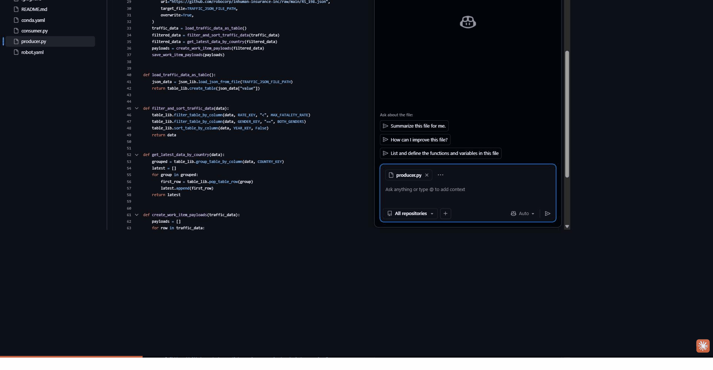

# Traffic Data Work Items — Robocorp Level III Certification



A producer-consumer RPA bot built with Robocorp and Python that automates an ETL pipeline for **Inhuman Insurance, Inc.** — fetching global road traffic fatality data from a public API, transforming it into business-ready records, and posting each record to an insurance sales system API via work items. This is the **Automation Certification Level III** project.

No browser automation. Pure API and data processing.

## What It Does

### Producer (`producer.py`)
1. **Downloads raw data** — fetches WHO road traffic fatality JSON from GitHub
2. **Transforms to a table** — loads into `RPA.Tables` for filtering and sorting
3. **Filters** — keeps only both-gender rows with a fatality rate below 5.0 per 100k
4. **Gets latest per country** — sorts by year descending, takes the first row per country
5. **Creates work items** — outputs one work item per country for the consumer to process

### Consumer (`consumer.py`)
1. **Loops work items** — processes each item from the producer
2. **Validates data** — checks country code is a valid 3-character ISO alpha-3 code
3. **POSTs to sales API** — sends valid records to the Inhuman Insurance sales system
4. **Handles exceptions** — marks items `done`, or fails them with typed exceptions:
   - `BUSINESS` / `INVALID_TRAFFIC_DATA` — bad country code
   - `APPLICATION` / `TRAFFIC_DATA_POST_FAILED` — API returned non-200

## Project Structure

```
robocorp-cert-iii/
├── producer.py       # Produce task: download, transform, create work items
├── consumer.py       # Consume task: validate, POST to API, handle exceptions
├── conda.yaml        # Python environment definition (managed by RCC)
├── robot.yaml        # Two task definitions: Produce data / Consume data
└── output/
    └── traffic.json  # Raw WHO data (generated at runtime by producer)
```

## Tech Stack

| Tool | Version |
|------|---------|
| Python | 3.12.8 |
| robocorp | 3.0.0 |
| rpaframework | 30.0.2 |
| requests | 2.32.3 |
| RCC | via conda.yaml |

## Running the Bot

**VS Code (Robocorp extension):**
1. Open the project folder
2. Robocorp panel → Run "Produce data" first, then "Consume data"

**Command line:**
```bash
# Step 1 — produce work items
rcc run --task "Produce data"

# Step 2 — consume work items
rcc run --task "Consume data"
```

In **Robocorp Control Room**, configure two process steps: one running `producer.py`, the other `consumer.py`. The Control Room passes work items between them automatically.

## Key Implementation Notes

- **Producer-consumer pattern** — the producer and consumer are fully decoupled; the Control Room orchestrates data handoff via work items
- `RPA.HTTP` downloads the raw WHO JSON; `RPA.JSON` and `RPA.Tables` handle transformation
- Business exceptions (invalid data) and application exceptions (API failures) are both handled with typed work item failures so failures are visible and retryable in Control Room
- Country validation uses ISO 3166-1 alpha-3 (3-character code check)
- The sales system API at `https://robocorp.com/inhuman-insurance-inc/sales-system-api` occasionally returns 500 errors — these are handled gracefully as `APPLICATION` exceptions

## Author

**Jeremy Vargo**
- Email: jeremy.e.vargo@gmail.com
- LinkedIn: [linkedin.com/in/jeremyevargo](https://linkedin.com/in/jeremyevargo)
- GitHub: [github.com/J3R3B3AR](https://github.com/J3R3B3AR)
